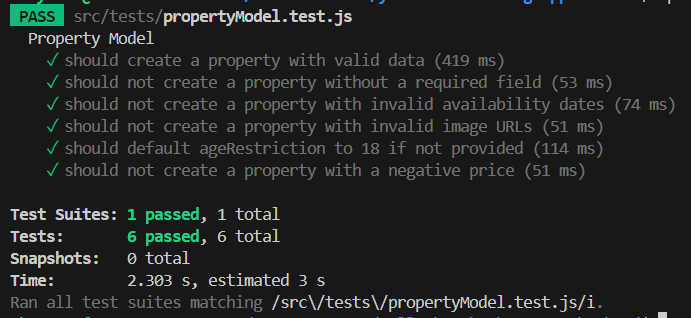

# T3A2-B: Full Stack App (Part B)

## Table of Contents

- [T3A2-B: Full Stack App (Part B)](#t3a2-b-full-stack-app-part-b)
  - [Table of Contents](#table-of-contents)
- [T3A2-B: Full Stack App (Part B)](#t3a2-b-full-stack-app-part-b-1)
  - [Yallambee Tiny Homes](#yallambee-tiny-homes)
  - [R1: Use of Minimum Required Technologies](#r1-use-of-minimum-required-technologies)
    - [Libraries Used In The Yallambee Booking Application](#libraries-used-in-the-yallambee-booking-application)
    - [Backend Libraries and tools](#backend-libraries-and-tools)
    - [Frontend Libraries and tools](#frontend-libraries-and-tools)
    - [DevLibraries and Tools](#devlibraries-and-tools)
  - [R2: Well-Designed Code](#r2-well-designed-code)
  - [R3: Source Control Methodology](#r3-source-control-methodology)
  - [R4: Teamwork Demonstration](#r4-teamwork-demonstration)
    - [Trello Board](#trello-board)
    - [Screenshots](#screenshots)
  - [R5: Working Application](#r5-working-application)
  - [R6: Cloud Deployment](#r6-cloud-deployment)
  - [R7: Intuitive User Interface](#r7-intuitive-user-interface)
    - [Screenshots](#screenshots-1)
  - [R8: Evidence of User Testing](#r8-evidence-of-user-testing)
    - [Testing Methodology](#testing-methodology)
    - [Testing Phases](#testing-phases)
    - [Detailed Test Cases and Results](#detailed-test-cases-and-results)
      - [Test Case 1: User Registration](#test-case-1-user-registration)
      - [Test Case 2: Property Search and Booking](#test-case-2-property-search-and-booking)
      - [Test Case 3: Profile Management](#test-case-3-profile-management)
      - [Test Case 4: Admin Property Management](#test-case-4-admin-property-management)
      - [Test Case 5: Admin User Management](#test-case-5-admin-user-management)
      - [Test Case 6: Booking Management by Admin](#test-case-6-booking-management-by-admin)
      - [Test Case 7: Cross-Browser and Device Compatibility](#test-case-7-cross-browser-and-device-compatibility)
    - [Before-and-After Evidence](#before-and-after-evidence)
    - [Conclusions and Recommendations](#conclusions-and-recommendations)
      - [Future Recommendations](#future-recommendations)
    - [Appendix](#appendix)
  - [R9: Formal Testing Framework](#r9-formal-testing-framework)
  - [Part A](#part-a)
    - [Purpose](#purpose)
    - [Functionality / Features](#functionality--features)
      - [MVP](#mvp)
      - [Stretch](#stretch)
    - [Target Audience](#target-audience)
    - [Tech Stack](#tech-stack)
  - [R2: Dataflow Diagram](#r2-dataflow-diagram)
    - [0 DFD (Context Diagram)](#0-dfd-context-diagram)
      - [Purpose](#purpose-1)
      - [External Entities](#external-entities)
      - [System](#system)
      - [Data Flows](#data-flows)
    - [1 DFD (Level 1 DFD)](#1-dfd-level-1-dfd)
      - [Purpose](#purpose-2)
      - [Processes](#processes)
      - [Data Stores](#data-stores)
      - [Data Flows](#data-flows-1)
      - [Diagram Overview](#diagram-overview)
  - [R3: Application Architecture Diagram](#r3-application-architecture-diagram)
    - [Diagram](#diagram)
    - [Overview](#overview)
    - [Components](#components)
      - [Front-End: ReactJS](#front-end-reactjs)
      - [Back-End: Node.js with Express.js](#back-end-nodejs-with-expressjs)
      - [Database: MongoDB](#database-mongodb)
      - [External Services](#external-services)
    - [Diagram Overview](#diagram-overview-1)
    - [Supporting Documentation](#supporting-documentation)
      - [Technical Specifications](#technical-specifications)
      - [Implementation Notes](#implementation-notes)
      - [Integration Points](#integration-points)
  - [R4: User Stories](#r4-user-stories)
    - [1. User Authentication](#1-user-authentication)
    - [2. Property Listing/s](#2-property-listings)
    - [3. Booking System](#3-booking-system)
    - [4. Payment Integration](#4-payment-integration)
    - [5. User Profile Management](#5-user-profile-management)
    - [6. Admin Dashboard](#6-admin-dashboard)
    - [7. User Reviews and Ratings](#7-user-reviews-and-ratings)
    - [8. Notifications](#8-notifications)
    - [9. Search and Filter](#9-search-and-filter)
  - [R5: Wireframes](#r5-wireframes)
    - [Wireframes](#wireframes)
    - [Typography and Colours](#typography-and-colours)
  - [R6: Project Management](#r6-project-management)
    - [Trello Board](#trello-board-1)
    - [Screenshots](#screenshots-2)
    - [Project Timeline](#project-timeline)
    - [Ways of Working](#ways-of-working)
    - [GitHub Workflow](#github-workflow)
    - [Client Feedback](#client-feedback)
    - [API Specifications](#api-specifications)
    - [Yallambee Tiny Home Booking App Setup](#yallambee-tiny-home-booking-app-setup)
    - [Application Commands](#application-commands)
  - [API Documentation for The Yallambee Booking Application](#api-documentation-for-the-yallambee-booking-application)
  - [Appendix](#appendix-1)
    - [References](#references)
    - [Contributors](#contributors)


# T3A2-B: Full Stack App (Part B)

## Yallambee Tiny Homes

Please see our deployed site [here](https://main--yallambee-booking-app-frontend.netlify.app/).

[Backend Repository](https://github.com/shayzimm/yallambee-booking-app-backend.git)

[Frontend Repository](https://github.com/Jow17/yallambee-booking-app-frontend.git)

## R1: Use of Minimum Required Technologies

- **MongoDB**: Utilised as the NoSQL database for managing data related to users, bookings, and properties.
- **Express**: Used as the backend framework to handle API requests and responses.
- **React**: Employed as the frontend framework to build a responsive and interactive user interface.
- **Node.js**: Served as the runtime environment for executing JavaScript code on the server side.

### Libraries Used In The Yallambee Booking Application 

Our application integrates several key libraries to ensure functionality, security, and performance. Below is a list of these libraries, why they were chosen, and how they benefit the project:

### Backend Libraries and tools

1. **bcrypt** (`^5.1.1`)  
     **Purpose**: Used for hashing passwords.  
     **Reason for Choosing**: Bcrypt is a widely trusted library for securely hashing passwords, which is essential for protecting user data. It adds an extra layer of security by making it difficult for attackers to retrieve original passwords even if the database is compromised.  
     **Benefit**: Enhances security by providing strong hashing algorithms, protecting user credentials.

2. **cloudinary** (`^2.4.0`)  
     **Purpose**: Cloud-based image and video management.  
     **Reason for Choosing**: Cloudinary provides easy integration for uploading, storing, and processing images and videos. This is essential for managing media content, especially for user-uploaded images in property listings.  
     **Benefit**: Simplifies the management of media files, offers powerful transformations, and reduces server load.  

3. **cors** (`^2.8.5`)  
      **Purpose**: Middleware to enable Cross-Origin Resource Sharing (CORS).  
      **Reason for Choosing**: CORS is critical for allowing resources to be requested from another domain, which is common in modern web applications where frontend and backend are often hosted separately.  
      **Benefit**: Enables secure cross-origin requests, essential for frontend-backend communication.  

4. **dotenv** (`^16.4.5`)  
     **Purpose**: Loads environment variables from a `.env` file.  
     **Reason for Choosing**: Dotenv allows sensitive information such as API keys, database credentials, and other configuration settings to be securely managed via environment variables.  
     **Benefit**: Keeps sensitive data out of the codebase and ensures a consistent configuration across different environments (development, testing, production).  

5. **express** (`^4.19.2`)  
     **Purpose**: Web framework for Node.js.  
     **Reason for Choosing**: Express is the most popular web framework for Node.js, known for its simplicity, flexibility, and robust features. It provides a foundation for building web applications and APIs.  
     **Benefit**: Streamlines the development of server-side logic, routing, and middleware management.  

6. **express-validator** (`^7.2.0`)  
     **Purpose**: Middleware for validating and sanitizing user inputs.  
     **Reason for Choosing**: Express-validator is crucial for ensuring that the data received from the user is valid, safe, and formatted correctly. It prevents common security issues like SQL injection and XSS attacks.  
     **Benefit**: Enhances security and data integrity by validating and sanitizing inputs before they reach the backend logic.  

7. **helmet** (`^7.1.0`)  
     **Purpose**: Helps secure Express apps by setting various HTTP headers.  
     **Reason for Choosing**: Helmet provides essential security features out of the box by setting HTTP headers that protect against well-known vulnerabilities.  
     **Benefit**: Enhances the security of the application by mitigating common security threats.  

8. **jsonwebtoken** (`^9.0.2`)  
     **Purpose**: Handles JSON Web Tokens (JWT) for authentication.  
     **Reason for Choosing**: JSON Web Tokens are a secure way of transmitting information between parties as a JSON object. They are commonly used for authentication in modern web applications.  
     **Benefit**: Enables secure, stateless authentication, allowing the app to maintain a seamless user experience while protecting sensitive information.  

9. **mongoose** (`^8.5.3`)  
     **Purpose**: Object Data Modeling (ODM) library for MongoDB and Node.js.  
     **Reason for Choosing**: Mongoose simplifies interactions with MongoDB by providing a schema-based solution to model data. It also handles data validation, casting, and business logic.  
     **Benefit**: Simplifies database interactions, ensures data consistency, and speeds up development by providing an elegant API for MongoDB.  

10. **morgan** (`^1.10.0`)  
      **Purpose**: HTTP request logger middleware for Node.js.  
      **Reason for Choosing**: Morgan is useful for logging requests to the server, which is essential for monitoring, debugging, and maintaining the application.  
      **Benefit**: Provides insightful logging, which helps in tracking the performance and diagnosing issues in the server.  

11. **multer** (`^1.4.5-lts.1`)  
      **Purpose**: Middleware for handling `multipart/form-data`, used for file uploads.  
      **Reason for Choosing**: Multer simplifies the process of handling file uploads in a Node.js/Express application, which is particularly useful for managing user-uploaded content like images.  
      **Benefit**: Facilitates easy and secure file uploads, ensuring that uploaded files are managed efficiently.  

12. **nodemailer** (`^6.9.14`)  
      **Purpose**: Library for sending emails from Node.js.  
      **Reason for Choosing**: Nodemailer is a powerful tool for sending emails, which is essential for user notifications, confirmations, and other email-based interactions in the application.  
      **Benefit**: Simplifies the process of sending emails, supports various transport methods, and allows for templating, ensuring a seamless user communication experience.

### Frontend Libraries and tools

1. **`@headlessui/react` (^2.1.3)**  
     **Purpose:** Provides unstyled, accessible components for React.  
     **Reason for Choosing:** Headless UI offers low-level primitives that are accessible and easy to style, allowing for more flexibility and customization in UI design.  
     **Benefit:** Enables the creation of fully accessible UI components without imposing styling constraints.  
2. **`axios` (^1.7.5)**  
     **Purpose:** Promise-based HTTP client for making requests.  
     **Reason for Choosing:** Axios simplifies the process of making HTTP requests, handling responses, and managing errors. It supports request and response interceptors, which are useful for handling authentication tokens.  
     **Benefit:** Provides a straightforward and flexible way to interact with APIs and manage asynchronous requests.  
3. **`date-fns` (^3.6.0)**  
     **Purpose:** Utility library for date manipulation.  
     **Reason for Choosing:** Date-fns offers a comprehensive set of functions for parsing, formatting, and manipulating dates, making it easier to handle date-related operations.  
     **Benefit:** Provides a modular and lightweight approach to date manipulation, avoiding the overhead of larger libraries like Moment.js.  
4. **`jwt-decode` (^4.0.0)**  
     **Purpose:** Decode JWT tokens.  
     **Reason for Choosing:** Jwt-decode is a lightweight library for decoding JSON Web Tokens (JWTs) to extract user information and other payload data.  
     **Benefit:** Simplifies token decoding, enabling access to user information and token validation on the client side.  
5. **`react` (^18.3.1)**  
     **Purpose:** Core library for building user interfaces.  
     **Reason for Choosing:** React provides a component-based architecture for building dynamic and interactive UIs. It is widely adopted and supported, with a rich ecosystem of tools and libraries.  
     **Benefit:** Facilitates the development of modern, performant, and maintainable front-end applications.  
6. **`react-datepicker` (^7.3.0)**  
     **Purpose:** Date picker component for React.  
     **Reason for Choosing:** React-datepicker offers a customizable and easy-to-use date picker component that integrates seamlessly with React applications.  
     **Benefit:** Enhances user experience by providing an intuitive interface for selecting dates.  
7. **`react-dom` (^18.3.1)**  
     **Purpose:** Provides DOM-specific methods for React.  
     **Reason for Choosing:** React-dom is required for rendering React components to the DOM and managing React’s rendering lifecycle.  
     **Benefit:** Ensures efficient and correct rendering of React components in the browser.  
8. **`react-hook-form` (^7.52.2)**  
     **Purpose:** Library for managing forms in React.  
     **Reason for Choosing:** React-hook-form simplifies form handling, validation, and state management, reducing boilerplate code and improving performance.  
     **Benefit:** Provides a performant and easy-to-use solution for form management with built-in support for validation.  
9. **`react-icons` (^5.3.0)**  
     **Purpose:** Collection of popular icons for React.  
     **Reason for Choosing:** React-icons provides a wide range of icons from various icon libraries in a convenient, React-compatible format.  
     **Benefit:** Allows easy integration of icons into React components with consistent styling and accessibility.  
10. **`react-router-dom` (^6.26.1)**  
      **Purpose:** Declarative routing for React applications.  
      **Reason for Choosing:** React-router-dom enables routing and navigation in React applications, allowing for the creation of single-page applications with multiple views.  
      **Benefit:** Facilitates the creation of a seamless navigation experience with dynamic route handling.  
11. **`spinners-react` (^1.0.7)**  
      **Purpose:** Collection of customizable loading spinners for React.  
      **Reason for Choosing:** Spinners-react provides a set of spinner components that can be easily integrated and styled to indicate loading states.  
      **Benefit:** Enhances user experience by providing visual feedback during asynchronous operations.  
12. **`swiper` (^11.1.11)**  
      **Purpose:** Modern mobile touch slider with hardware-accelerated transitions.  
      **Reason for Choosing:** Swiper offers a flexible solution for creating touch-friendly sliders and carousels in React applications.  
      **Benefit:** Provides a smooth slider experience with a wide range of customization options.

### DevLibraries and Tools

1. **`@eslint/js` (^9.9.0)**  
     **Purpose:** ESLint rules and configuration for JavaScript.  
     **Reason for Choosing:** Provides a standard set of linting rules to ensure code quality and consistency.  
     **Benefit:** Helps maintain clean and error-free code by enforcing coding standards.  
2. **`@testing-library/jest-dom` (^6.5.0)**  
     **Purpose:** Custom matchers for testing DOM nodes with Jest.  
     **Reason for Choosing:** Extends Jest with additional matchers for more expressive and readable tests.  
     **Benefit:** Enhances testing capabilities by providing custom assertions for DOM elements.  
3. **`@testing-library/react` (^16.0.1)**  
     **Purpose:** Testing library for React components.  
     **Reason for Choosing:** Provides utilities for testing React components in a way that focuses on user interactions and behavior.  
     **Benefit:** Encourages testing practices that ensure components work as expected from the user's perspective.  
4. **`@testing-library/user-event` (^14.5.2)**  
     **Purpose:** Utilities for simulating user events in tests.  
     **Reason for Choosing:** Allows for simulating real user interactions in tests, improving the accuracy of tests.  
     **Benefit:** Facilitates more realistic testing scenarios by simulating user actions.  
5. **`@types/react` (^18.3.3)**  
     **Purpose:** TypeScript definitions for React.  
     **Reason for Choosing:** Provides TypeScript type definitions for React, improving development with type checking and code completion.  
     **Benefit:** Enhances the development experience by providing accurate type information and reducing errors.  
6. **`@types/react-dom` (^18.3.0)**  
     **Purpose:** TypeScript definitions for ReactDOM.  
     **Reason for Choosing:** Provides TypeScript type definitions for ReactDOM, ensuring type safety for DOM-related operations.  
     **Benefit:** Improves type safety and developer experience when working with ReactDOM.  
7. **`@vitejs/plugin-react-swc` (^3.5.0)**  
     **Purpose:** Vite plugin for React with SWC support.  
     **Reason for Choosing:** Provides fast compilation and transformation of React code using SWC.  
     **Benefit:** Accelerates build times and improves performance during development.  
8. **`autoprefixer` (^10.4.20)**  
     **Purpose:** PostCSS plugin for automatically adding vendor prefixes.  
     **Reason for Choosing:** Autoprefixer ensures that CSS is compatible with different browsers by adding necessary vendor prefixes.  
     **Benefit:** Simplifies CSS maintenance and ensures cross-browser compatibility.  
9. **`eslint` (^9.9.0)**  
     **Purpose:** Linter for identifying and reporting code issues.  
     **Reason for Choosing:** ESLint helps maintain code quality and consistency by identifying potential errors and enforcing coding standards.  
     **Benefit:** Improves code quality by providing tools for linting and fixing code issues.  
10. **`eslint-plugin-react` (^7.35.0)**  
      **Purpose:** ESLint plugin for React-specific linting rules.  
      **Reason for Choosing:** Provides rules and recommendations for React code, ensuring best practices are followed.  
      **Benefit:** Enhances linting for React components and promotes consistent coding practices.  
11. **`eslint-plugin-react-hooks` (^5.1.0-rc.0)**  
      **Purpose:** ESLint plugin for React Hooks rules.  
      **Reason for Choosing:** Enforces best practices and rules for using React Hooks.  
      **Benefit:** Helps prevent common mistakes and promotes the correct use of React Hooks.  
12. **`eslint-plugin-react-refresh` (^0.4.9)**  
      **Purpose:** ESLint plugin for React Fast Refresh.  
     **Reason for Choosing:** Supports ESLint integration with React Fast Refresh, improving development feedback.  
     **Benefit:** Enhances the development experience with live reloading and better error feedback.  
13. **`globals` (^15.9.0)**  
      **Purpose:** Provides global variables for various environments.  
      **Reason for Choosing:** Defines global variables for different environments to avoid undefined variable errors in linting.  
      **Benefit:** Ensures that global variables are recognized and avoids linting errors.  
14. **`jsdom` (^25.0.0)**  
      **Purpose:** JavaScript implementation of the web standards, used for testing.  
      **Reason for Choosing:** Provides a simulated browser environment for testing DOM manipulations and interactions.  
      **Benefit:** Allows for testing React components as if they were running in a real browser environment.  
15. **`postcss` (^8.4.41)**  
      **Purpose:** Tool for transforming CSS with JavaScript plugins.  
      **Reason for Choosing:** PostCSS is used for processing CSS with plugins like Autoprefixer and Tailwind CSS.  
      **Benefit:** Enables powerful CSS transformations and optimizations.  
16. **`tailwindcss` (^3.4.10)**  
      **Purpose:** Utility-first CSS framework.  
      **Reason for Choosing:** Tailwind CSS provides a set of low-level utility classes for building custom designs without

## R2: Well-Designed Code

- **Separation of Concerns**: The application is divided into modules, each responsible for a specific aspect (e.g., user management, booking management, property management).
- **DRY Principles**: Code was refactored to avoid repetition and improve maintainability.
- **Good Code Flow Control**: The flow of data and control structures follows logical patterns aligned with the defined user stories.
- **Object-Oriented Principles**: Classes and objects were employed where applicable, particularly in the backend for defining models and controllers.
- **Appropriate Data Structures**: Utilised JavaScript data structures like arrays, objects, and maps to efficiently manage and manipulate data.

## R3: Source Control Methodology

- **Git**: The project was managed using Git for version control. Regular commits were made to track progress, and branches were used for feature development.
- **GitHub**: Our backend and frontend repositories are hosted on GitHub, enabling collaboration and code reviews among team members.
  - **Backend Repo**: https://github.com/shayzimm/yallambee-booking-app-backend.git
  - **Frontend Repo**: https://github.com/Jow17/yallambee-booking-app-frontend.git
- **Branching Strategy**: Our branching strategy can be seen [here](.github/step-by-step-github-workflow.md) and evidence of our extensive commit history can be viewed in our repositories.

## R4: Teamwork Demonstration

- **Project Management**: Our team followed Agile methodologies with regular stand-ups.
- **Task Delegation**: Tasks were assigned using Trello, ensuring that all team members were clear on their responsibilities and deadlines.

### Trello Board

We are using Trello to manage our project tasks, track progress, and collaborate as a team. The board is organised into columns such as "Backlog", "Design", "To Do", "Doing", and "Done" to reflect the current status of each task.

Our Kanban Board can be seen [here](https://trello.com/invite/b/66b2f86152f9d00b5467bbb8/ATTIe1afc6a791759e8fd5f9411c76de9561A7CDF884/full-stack-project).

### Screenshots

- **Initial Setup**
  
  
- **Refined Setup**
  
- **Part A Tasks Done**
  
- **17th August**
  
- **20th August**
  
- **27th August**
  
- **30th August**
  
- **31st August**
  
- **1st September**
  


## R5: Working Application

- The application was developed to meet both client and user needs. The final product allows users to browse and book properties while providing administrators with tools to manage users, bookings, and properties.

## R6: Cloud Deployment

- **Hosting**: Our backend is hosted on Render [here](https://yallambee-booking-app-backend.onrender.com/) and our frontend is hosted on Netlify [here](https://main--yallambee-booking-app-frontend.netlify.app/).
- **CI/CD Pipeline**: A continuous integration and deployment pipeline was set up to automate testing and deployment processes.

## R7: Intuitive User Interface

- **Responsive Design**: The application was designed with responsiveness in mind, ensuring it works well on various screen sizes.
- **User-Friendly**: The interface was developed to be intuitive, with clear navigation and well-placed calls to action.

### Screenshots

- **Home**
  
  
- **Booking**
  
  
- **Register**
  
- **Sign In**
  
- **Admin Dashboard**
  
  
  
  
  
- **User Profile**
  

## R8: Evidence of User Testing

### Testing Methodology

The user testing was conducted in multiple phases, focusing on different components of the app, including the booking system, user management, and admin functionalities. Both manual and automated testing methods were employed, involving real users and simulated scenarios.

### Testing Phases

1. **Phase 1: Guest User Testing**
   - Focused on the registration, booking, and profile management features.
   - Users were tasked with signing up, searching for properties, making a booking, and managing their bookings.

2. **Phase 2: Admin User Testing**
   - Focused on admin-specific features, such as property management, user management, and booking management.
   - Admins tested the ability to add, edit, and delete properties, users, and bookings.

3. **Phase 3: Cross-Browser and Device Testing**
   - Ensured that the app functions correctly across different browsers and devices.
   - Tested on Chrome, Firefox, Safari, and Edge, as well as on mobile and tablet devices.

### Detailed Test Cases and Results

#### Test Case 1: User Registration

- **Objective**: To ensure that users can successfully register for an account.
- **Scenario**: A new user attempts to sign up with valid and invalid data.
- **Result**: Users were able to register successfully with valid data. Error messages were appropriately displayed for invalid inputs.
- **Issues Found**: None.
- **Actions Taken**: No action needed.

#### Test Case 2: Property Search and Booking

- **Objective**: To test the search and booking functionalities.
- **Scenario**: Users search for available properties and make a booking.
- **Result**: The search and booking processes were smooth, with users able to find properties and complete bookings without issues.
- **Issues Found**: Minor UI issue where the booking confirmation message was partially obscured on smaller screens.
- **Actions Taken**: Adjusted the CSS to ensure the confirmation message is fully visible on all screen sizes.

#### Test Case 3: Profile Management

- **Objective**: To verify that users can manage their profiles and view their bookings.
- **Scenario**: Users log in, update their profile details, and view their booking history.
- **Result**: Users were able to update their profile details and view their bookings successfully. However, there was confusion about how to cancel bookings.
- **Issues Found**: Users were unsure how to cancel bookings; feedback indicated a desire for clearer communication.
- **Actions Taken**: Added a message in the "Your Bookings" section instructing users to contact support for cancellations.

#### Test Case 4: Admin Property Management

- **Objective**: To test the admin's ability to add, edit, and delete properties.
- **Scenario**: Admin users add a new property, edit existing property details, and delete a property.
- **Result**: Admins were able to manage properties without issues.
- **Issues Found**: None.
- **Actions Taken**: No action needed.

#### Test Case 5: Admin User Management

- **Objective**: To ensure admins can manage user accounts effectively.
- **Scenario**: Admins create, edit, and delete user accounts.
- **Result**: All functions worked as expected.
- **Issues Found**: None.
- **Actions Taken**: No action needed.

#### Test Case 6: Booking Management by Admin

- **Objective**: To verify that admins can manage bookings, including updates and cancellations.
- **Scenario**: Admins edit and cancel bookings.
- **Result**: Bookings were successfully updated and canceled by admins. However, the update modal did not close automatically, and the booking list required a refresh to show updated details.
- **Issues Found**: The modal did not close automatically after an update, and the updated booking was not immediately reflected in the UI.
- **Actions Taken**: Adjusted the state management and UI logic to ensure the modal closes upon successful update and the booking list refreshes automatically.

#### Test Case 7: Cross-Browser and Device Compatibility

- **Objective**: To ensure the app functions across various browsers and devices.
- **Scenario**: Test all major features on different browsers and devices.
- **Result**: The app performed consistently across all tested browsers and devices. Minor layout issues were identified on older browsers.
- **Issues Found**: Minor layout inconsistencies on older versions of Safari.
- **Actions Taken**: Added browser-specific CSS fixes to ensure compatibility.

### Before-and-After Evidence

- **UI Improvements**: Adjusted the UI based on user feedback to improve clarity and usability.
  - Before: The booking confirmation message was not fully visible on mobile devices.
  - After: The message is now fully visible across all devices.
  
- **Functionality Enhancements**: Improved the modal behavior for admin booking updates.
  - Before: The modal did not close automatically, requiring a manual close by the admin.
  - After: The modal now closes automatically upon successful booking update.

### Conclusions and Recommendations

The user testing process was instrumental in refining Yallambee Tiny Homes. Feedback from real users allowed us to identify and resolve usability issues, leading to a more polished and user-friendly final product. The app is now well-tested across different scenarios, browsers, and devices, with all critical bugs addressed.

#### Future Recommendations

- **Ongoing Testing**: Continue to perform regular user testing, especially after major updates or feature additions.
- **User Feedback**: Implement a feedback mechanism within the app to capture ongoing user experiences and improve continuously.
- **Performance Monitoring**: Set up monitoring tools to track app performance in production and quickly address any issues that arise.

### Appendix

- **Testing Logs**: Detailed logs of each testing session are available in the project management tool (e.g., Trello, Jira).
- **Screenshots**: Before-and-after screenshots highlighting key improvements.
- **Early Frontend**
  
  
  
- **Mid-Project**
  
  
- **Getting there!**
  
  

## R9: Formal Testing Framework

- **Jest**: The app was tested using Jest for unit and integration tests. Aiming for 90% test coverage, the tests ensured that both frontend and backend functionalities were thoroughly checked.

- **Backend Testing**
  
  
  
  
  
  
- **Frontend Testing**
  

## Part A

### Purpose

The Yallambee Tiny Homes Booking App is designed to provide a seamless platform for users to browse and book stays in a unique tiny home. While Yallambee is currently available through Airbnb, this app will offer greater control over bookings, allowing the client to provide a more personalised and direct experience for their guests. The app empowers guests to explore the Yallambee property, check availability, make bookings, and manage their reservations effortlessly, all in one place.

For admin users, the platform offers robust tools to manage property listings, oversee bookings, and maintain user profiles, ensuring that the operations of Yallambee Tiny Homes are handled smoothly and efficiently. By transitioning to their own booking system, the client aims to enhance the guest experience and streamline their business operations, providing a tailored service that aligns with the unique and tranquil nature of Yallambee.

### Functionality / Features

#### MVP

- **User Authentication**: Users can register, log in, and manage their profiles.
- **Property Listing/s**: Users can view available properties (one, initially), including details such as price, location, and amenities.
- **Booking System**: Users can make a reservation by selecting available dates and processing payments (payments are a stretch goal).
- **Admin Dashboard**: Admins can add, update, and delete property listings, manage bookings, and oversee user accounts.

#### Stretch

- **Payment Integration**: Users can securely process payments for their reservations through a third-party payment gateway.
- **User Reviews and Ratings**: Users can leave reviews and rate their stay after completing a booking. Admins will have the ability to moderate reviews to ensure appropriate content is displayed.
- **Notifications**: Users will receive email or SMS notifications for booking confirmations, payment receipts, and reminders. Admins will also receive notifications for new bookings and cancellations, ensuring they are always up-to-date with the latest activities on the platform.

### Target Audience

The target audience for Yallambee Tiny Homes primarily includes young, professional couples from Sydney and Canberra who are seeking a unique and tranquil getaway. These travelers are looking for a chance to disconnect from their busy lives and enjoy a peaceful stay in a beautiful, off-grid tiny home. Additionally, the app is designed to cater to the owners of Yallambee, who wish to efficiently manage bookings, listings, and guest interactions through a more controlled and personalised platform.

### Tech Stack

- **Frontend**: React.js, Tailwind CSS
- **Backend**: Node.js, Express.js
- **Database**: MongoDB
- **Authentication**: JWT
- **Payment Processing**: Stripe, PayPal
- **Notifications**: Nodemailer (Email), Twilio (SMS)

---

## R2: Dataflow Diagram

The Dataflow Diagram represents the flow of data within our booking app. It includes the processes that interact with data inputs and outputs, as well as data storage.

### 0 DFD (Context Diagram)

#### Purpose


The 0 DFD provides a high-level overview of the system, showing the interactions between external entities and the web application.

#### External Entities

1. **User**
   - **Interactions:**
     - Views property availability
     - Makes bookings
     - Submits reviews
     - Receives notifications

2. **Admin**
   - **Interactions:**
     - Manages property listings
     - Manages bookings
     - Manages reviews

#### System

- **Web Application**
  - Handles user requests and admin functions.

#### Data Flows

1. **User to Web Application:**
   - **Input Flows:**
     - Request for property availability
     - Booking requests
     - Review submissions
     - Authentication requests (registration, login)
   - **Output Flows:**
     - Display of available properties and dates
     - Booking confirmation
     - Review confirmation
     - User profile data

2. **Admin to Web Application:**
   - **Input Flows:**
     - Commands for managing properties, bookings, and reviews
   - **Output Flows:**
     - Updated listings, bookings, and reviews

### 1 DFD (Level 1 DFD)


#### Purpose

The 1 DFD provides a detailed view of the main processes within the system and their interactions with data stores and external entities.

#### Processes

1. **1.1 Viewing Property Availability**
2. **1.2 Booking System**
3. **1.3 Review System**
4. **1.4 Notification System**
5. **1.5 Admin Functions**

#### Data Stores

1. **D1: Property Data Store**
   - Stores property details (descriptions, images, availability).

2. **D2: Booking Data Store**
   - Stores booking information (dates, user details).

3. **D3: Review Data Store**
   - Stores user reviews and ratings.

4. **D4: User Data Store**
   - Stores user profiles and authentication details.

#### Data Flows

1. **Viewing Property Availability (Process 1.1):**
   - **Input Flows:**
     - User request for property availability
   - **Output Flows:**
     - Display of available properties and dates
   - **Data Interactions:**
     - Fetch data from **Property Data Store** and **Booking Data Store**

2. **Booking System (Process 1.2):**
   - **Input Flows:**
     - User booking request
   - **Output Flows:**
     - Confirmation of booking and updated availability
   - **Data Interactions:**
     - Update **Booking Data Store**
     - Potentially modify **Property Data Store**

3. **Review System (Process 1.3):**
   - **Input Flows:**
     - User review submission
   - **Output Flows:**
     - Confirmation of review submission
   - **Data Interactions:**
     - Save reviews in **Review Data Store**

4. **Notification System (Process 1.4):**
   - **Input Flows:**
     - Triggers based on user actions (e.g., booking confirmation)
   - **Output Flows:**
     - Notification messages sent to users and admins
   - **Data Interactions:**
     - Use notification services for sending messages

5. **Admin Functions (Process 1.5):**
   - **Input Flows:**
     - Admin commands for managing properties, bookings, and reviews
   - **Output Flows:**
     - Updated listings, bookings, and reviews
   - **Data Interactions:**
     - Modify data in **Property Data Store**, **Booking Data Store**, and **Review Data Store**

#### Diagram Overview

- **Processes:**
  - **1.1:** Retrieves and displays available properties.
  - **1.2:** Manages booking requests and updates availability.
  - **1.3:** Handles user review submissions.
  - **1.4:** Sends notifications based on user actions.
  - **1.5:** Manages property listings, bookings, and reviews.

- **Data Stores:**
  - **D1:** Contains property details.
  - **D2:** Contains booking information.
  - **D3:** Contains user reviews and ratings.
  - **D4:** Contains user profiles and authentication data.

- **External Entities:**
  - **User:** Interacts with the processes to view properties, make bookings, and leave reviews.
  - **Admin:** Interacts with processes for managing properties, bookings, and reviews.
  
---

## R3: Application Architecture Diagram

The Application Architecture Diagram outlines the high-level structure of the app, including the frontend, backend, database, and external services.

### Diagram


### Overview

Application Architecture Diagram outlines the high-level structure of Full Stack web application. It illustrates the major components, their interactions, and the technologies used. This application uses the MERN stack, including MongoDB, Express.js, ReactJS, and Node.js.

### Components

#### Front-End: ReactJS

- **Components:**
  - **Homepage:** General information and navigation.
  - **Property Listings:** Display of available properties and details.
  - **Booking Page:** View availability and make reservations.
  - **User Profile:** Manage user information and preferences.
  - **Admin Dashboard:** Manage properties, bookings, and reviews.

- **State Management:**
  - **React Hooks:** `useState`, `useEffect`.
  - **Optional:** Redux for complex state management.

- **UI Design:**
  - **CSS:**

- **Integration:**
  - Connects to backend APIs for authentication, bookings, and reviews.

#### Back-End: Node.js with Express.js

- **API Layer:**
  - **Routes:**
    - **User Authentication:** Registration, login, profile management using JWT.
    - **Property Management:** Adding, updating, and deleting property listings.
    - **Booking Management:** Checking availability and making reservations.
    - **Admin Dashboard:** Managing and updating listings, bookings, and reviews.

- **Business Logic:**
  - Handles authentication, booking logic, and administrative tasks.

#### Database: MongoDB

- **Collections:**
  - **Users:** User profiles and authentication details.
  - **Listings:** Property information (descriptions, images, availability).
  - **Bookings:** Reservation details (user information, dates).
  - **Reviews:** User reviews and ratings.

#### External Services

- **Payment Gateway (Future Feature):**
  - **Options:** Stripe, PayPal.

- **Notification Services (Future Feature):**
  - **Options:**
    - **Email:** Nodemailer.
    - **SMS:** Twilio.

### Diagram Overview

- **Front-End:**
  - ReactJS components interact with the backend API layer for user actions.

- **Back-End:**
  - The Express.js API layer processes requests, handles business logic, and communicates with MongoDB.

- **Database:**
  - MongoDB stores and retrieves data as needed.

- **External Services:**
  - Integrates with the backend for payment processing and notifications.

### Supporting Documentation

#### Technical Specifications

- **ReactJS:** Front-end library for building UIs.
- **Node.js:** JavaScript runtime for server-side code.
- **Express.js:** Web framework for RESTful APIs.
- **MongoDB:** NoSQL database for data storage.
- **JWT:** JSON Web Token for secure authentication.
- **Payment Gateways:** Stripe, PayPal (for future integration).
- **Notification Services:** Nodemailer, Twilio (for future integration of email and SMS).

#### Implementation Notes

- Follow security best practices for authentication and data handling.
- Optimise state management and API interactions for performance.
- Plan for scalability in both database design and application architecture.

#### Integration Points

- **Front-End:** Makes API calls to the Express.js backend for data operations.
- **Back-End:** Manages business logic and interacts with MongoDB.
- **External Services:** Handles payments and notifications integrated into the backend.

---

## R4: User Stories

### 1. User Authentication

- **User Story 1**: As a user, I want to register an account so that I can log in and access personalised features.
  - **Acceptance Criteria**:
    - User can register with an email and password.
    - User receives a confirmation email after registration.
    - Passwords are securely hashed and stored.
  - **Checklist**:
    - [ ] Design registration form UI.
    - [ ] Implement backend logic for user registration.
    - [ ] Set up email confirmation process.
    - [ ] Implement password hashing and storage.
    - [ ] Test registration flow end-to-end.

- **User Story 2**: As a user, I want to log in to my account so that I can access my profile and booking history.
  - **Acceptance Criteria**:
    - User can log in with their registered email and password.
    - User receives a JWT token upon successful login.
    - Invalid login attempts are handled with appropriate error messages.
  - **Checklist**:
    - [ ] Design login form UI.
    - [ ] Implement backend logic for user authentication.
    - [ ] Set up JWT token generation and storage.
    - [ ] Handle error messages for invalid login attempts.
    - [ ] Test login flow with valid and invalid credentials.

- **User Story 3**: As a user, I want to reset my password so that I can regain access to my account if I forget my password.
  - **Acceptance Criteria**:
    - User can request a password reset by providing their email.
    - User receives an email with a password reset link.
    - User can reset the password using the provided link.
  - **Checklist**:
    - [ ] Design password reset request UI.
    - [ ] Implement backend logic for password reset requests.
    - [ ] Set up email with reset link functionality.
    - [ ] Implement password reset form and logic.
    - [ ] Test password reset process from request to completion.

### 2. Property Listing/s

- **User Story 4**: As a user, I want to browse available properties (single listing initially) so that I can choose the best one for my stay.
  - **Acceptance Criteria**:
    - User can view a list of properties with thumbnails, names, locations, and prices.
    - User can filter properties by location, price range, and amenities.
    - Property availability is clearly indicated.
  - **Checklist**:
    - [ ] Design property listing page UI.
    - [ ] Implement backend API to retrieve properties.
    - [ ] Develop frontend to display properties with filtering options.
    - [ ] Display property availability status.
    - [ ] Test property listing and filtering functionality.

- **User Story 5**: As a user, I want to view detailed information about a property so that I can decide if it meets my needs.
  - **Acceptance Criteria**:
    - User can view detailed property descriptions, images, amenities, and reviews.
    - User can see the price per night and availability for selected dates.
  - **Checklist**:
    - [ ] Design property detail page UI.
    - [ ] Implement backend API to retrieve property details.
    - [ ] Display property images, descriptions, amenities, and reviews.
    - [ ] Show price per night and availability for selected dates.
    - [ ] Test the property detail page for accurate data display.

### 3. Booking System

- **User Story 6**: As a user, I want to check the availability of a property for my selected dates so that I can book it if it’s available.
  - **Acceptance Criteria**:
    - User can select check-in and check-out dates using a date picker.
    - The system checks the availability of the property for the selected dates.
    - User receives immediate feedback on availability.
  - **Checklist**:
    - [ ] Design booking date selection UI.
    - [ ] Implement date picker functionality.
    - [ ] Develop backend API to check property availability.
    - [ ] Display availability status based on selected dates.
    - [ ] Test availability check process with different date ranges.

- **User Story 7**: As a user, I want to book a property so that I can secure my stay for the selected dates.
  - **Acceptance Criteria**:
    - User can fill out a booking form with personal details and preferences.
    - User sees a summary of their booking before confirming.
    - Booking confirmation is provided after successful payment.
  - **Checklist**:
    - [ ] Design booking form UI.
    - [ ] Implement backend logic for booking creation.
    - [ ] Display booking summary before confirmation.
    - [ ] Integrate payment gateway for booking confirmation.
    - [ ] Test end-to-end booking process.

- **User Story 8**: As a user, I want to receive a confirmation of my booking via email so that I have a record of my reservation.
  - **Acceptance Criteria**:
    - User receives an email with booking details, including dates, property name, and total cost.
    - Email contains instructions for check-in and contact information.
  - **Checklist**:
    - [ ] Set up email notification service.
    - [ ] Create email templates for booking confirmation.
    - [ ] Implement backend logic to trigger email on booking confirmation.
    - [ ] Ensure booking details are accurately reflected in the email.
    - [ ] Test email notification for different booking scenarios.

- **User Story 9**: As an admin, I want to view and manage all bookings so that I can keep track of reservations and availability.
  - **Acceptance Criteria**:
    - Admin can view a list of all bookings with details such as dates, user information, and status.
    - Admin can modify or cancel bookings if necessary.
    - Booking statuses (e.g., confirmed, pending, cancelled) are clearly indicated.
  - **Checklist**:
    - [ ] Design admin booking management UI.
    - [ ] Implement backend API to retrieve and manage bookings.
    - [ ] Enable admin to modify or cancel bookings.
    - [ ] Display booking statuses and details clearly.
    - [ ] Test admin booking management functionality.

### 4. Payment Integration

- **User Story 10**: As a user, I want to securely pay for my booking using my credit card so that I can confirm my reservation.
  - **Acceptance Criteria**:
    - User can enter credit card information securely.
    - Payment is processed through a third-party service like Stripe.
    - User receives a payment confirmation upon successful transaction.
  - **Checklist**:
    - [ ] Design payment form UI.
    - [ ] Integrate Stripe (or other payment gateway) for payment processing.
    - [ ] Implement secure handling of payment data.
    - [ ] Generate and display payment confirmation.
    - [ ] Test payment process from start to finish.

- **User Story 11**: As an admin, I want to view payment transactions so that I can track revenue and manage financial records.
  - **Acceptance Criteria**:
    - Admin can view a list of all payment transactions, including amounts, dates, and booking IDs.
    - Admin can issue refunds if necessary.
  - **Checklist**:
    - [ ] Design admin payment management UI.
    - [ ] Implement backend API to retrieve payment transactions.
    - [ ] Enable admin to view transaction details and issue refunds.
    - [ ] Test payment transaction tracking and refund process.

### 5. User Profile Management

- **User Story 12**: As a user, I want to view and edit my profile information so that my details are up to date.
  - **Acceptance Criteria**:
    - User can view their profile information, including name, email, and booking history.
    - User can update their personal details and save changes.
    - Profile updates are reflected immediately.
  - **Checklist**:
    - [ ] Design user profile page UI.
    - [ ] Implement backend API to retrieve and update user profile.
    - [ ] Develop frontend logic to handle profile updates.
    - [ ] Ensure real-time update of profile information.
    - [ ] Test profile management functionality for accuracy.

- **User Story 13**: As a user, I want to view my booking history so that I can keep track of my past and upcoming stays.
  - **Acceptance Criteria**:
    - User can view a list of past and upcoming bookings with details such as dates, property names, and statuses.
    - User can click on a booking to view more details or make changes.
  - **Checklist**:
    - [ ] Design booking history UI.
    - [ ] Implement backend API to retrieve booking history.
    - [ ] Display past and upcoming bookings clearly.
    - [ ] Enable interaction with booking details for further actions.
    - [ ] Test booking history display and functionality.

### 6. Admin Dashboard

- **User Story 14**: As an admin, I want to add, update, and delete property listings so that I can manage the available accommodations.
  - **Acceptance Criteria**:
    - Admin can create new property listings with details such as name, description, location, and price.
    - Admin can update existing property details.
    - Admin can delete property listings that are no longer available.
  - **Checklist**:
    - [ ] Design admin property management UI.
    - [ ] Implement backend API for CRUD operations on properties.
    - [ ] Enable admin to add, update, and delete properties.
    - [ ] Ensure real-time updates to property listings.
    - [ ] Test property management functionality for accuracy.

- **User Story 15**: As an admin, I want to manage user accounts so that I can handle customer inquiries and issues.
  - **Acceptance Criteria**:
    - Admin can view a list of all users with their profiles and booking history.
    - Admin can update user roles (e.g., upgrade a user to an admin).
    - Admin can deactivate or delete user accounts if necessary.
  - **Checklist**:
    - [ ] Design admin user management UI.
    - [ ] Implement backend API to retrieve and manage user accounts.
    - [ ] Enable admin to update user roles and deactivate accounts.
    - [ ] Ensure safe handling of user data during updates.
    - [ ] Test user management functionality for completeness.

### 7. User Reviews and Ratings

- **User Story 16**: As a user, I want to leave a review and rate my stay so that I can share my experience with others.
  - **Acceptance Criteria**:
    - User can submit a review and rating after their stay.
    - Review is displayed on the property listing page after admin approval.
    - User can edit or delete their review if needed.
  - **Checklist**:
    - [ ] Design review submission UI.
    - [ ] Implement backend API to handle reviews and ratings.
    - [ ] Develop frontend logic for displaying reviews.
    - [ ] Enable admin review moderation.
    - [ ] Test review submission, moderation, and display functionality.

- **User Story 17**: As an admin, I want to moderate reviews so that only appropriate content is displayed on the site.
  - **Acceptance Criteria**:
    - Admin can review and approve or reject user reviews.
    - Admin can edit or delete reviews that violate guidelines.
  - **Checklist**:
    - [ ] Design admin review moderation UI.
    - [ ] Implement backend logic for review approval and rejection.
    - [ ] Enable admin to edit or delete reviews as necessary.
    - [ ] Test moderation process to ensure proper functionality.

### 8. Notifications

- **User Story 18**: As a user, I want to receive notifications about my bookings and payment status so that I am always informed.
  - **Acceptance Criteria**:
    - User receives email notifications for booking confirmations, cancellations, and payment receipts.
    - User can opt-in for SMS notifications for reminders or urgent updates.
  - **Checklist**:
    - [ ] Set up email and SMS notification services.
    - [ ] Implement backend logic to trigger notifications.
    - [ ] Create notification templates for different scenarios.
    - [ ] Enable user preference settings for notifications.
    - [ ] Test notifications for accuracy and timeliness.

- **User Story 19**: As an admin, I want to be notified of new bookings and cancellations so that I can manage the properties effectively.
  - **Acceptance Criteria**:
    - Admin receives notifications for new bookings, cancellations, and user inquiries.
    - Notifications include relevant details such as booking ID, user information, and dates.
  - **Checklist**:
    - [ ] Set up admin notification system.
    - [ ] Implement backend logic for triggering admin notifications.
    - [ ] Ensure notifications contain all necessary information.
    - [ ] Test admin notifications for various scenarios.

### 9. Search and Filter

- **User Story 20**: As a user, I want to search for properties based on specific criteria so that I can find accommodation that suits my needs.
  - **Acceptance Criteria**:
    - User can enter search criteria such as location, price range, and amenities.
    - Search results are filtered based on the entered criteria.
    - User can sort results by price, availability, or rating.
  - **Checklist**:
    - [ ] Design search and filter UI.
    - [ ] Implement backend API to support search and filtering.
    - [ ] Develop frontend logic for dynamic search and filtering.
    - [ ] Enable sorting of results by various criteria.
    - [ ] Test search and filter functionality for accuracy.

---

## R5: Wireframes

Wireframes provide a visual representation of the app's layout for various screen sizes. These wireframes guide the design and development of the user interface.

### Wireframes

- **Homepage**
  
- **Property Listing Page**
  
- **Booking Page**
  
- **Payment Page** 
  
- **Review Page** 
  
- **Create Account Page** 
  
- **Login Page** 
  
- **User Profile Page**
  
- **Admin Dashboard**
  

### Typography and Colours

- **Typography**
  

- **Colours**
  

---

## R6: Project Management

### Trello Board

We are using Trello to manage our project tasks, track progress, and collaborate as a team. The board is organised into columns such as "Backlog", "Design", "To Do", "Doing", and "Done" to reflect the current status of each task.

Our Kanban Board can be seen [here](https://trello.com/invite/b/66b2f86152f9d00b5467bbb8/ATTIe1afc6a791759e8fd5f9411c76de9561A7CDF884/full-stack-project).

### Screenshots

- **Initial Setup**
  
  
- **Refined Setup**
  
- **Part A Tasks Done**
  

### Project Timeline

As a team, we created a prospective [timeline](docs/project_management/project_timeline.md) to help us stay on track with our tasks and better manage the project.

### Ways of Working

We developed a Ways of Working document to enhance communication, collaboration, and efficiency within our team. We wanted to establish that everyone is aligned and working towards the same goals, with clear processes in place to support successful project completion. Please see [here](docs/project_management/WaysOfWorking.md).

### GitHub Workflow

We have outlined our GitHub workflow and branching stategy [here](.github/step-by-step-github-workflow.md).

### Client Feedback

We collated feedback and ideas from our client [here](docs/project_management/client_feedback.md). This document will be used throughout the project and iterated with client feedback as the project progresses.

### API Specifications

Our draft API specs can be found [here](docs/project_management/API_specs.md).

---

### Yallambee Tiny Home Booking App Setup

This guide will help you set up the backend of the Yallambee Tiny Homes Booking App on your local machine.

**Prerequisites**
Before you begin, ensure you have the following installed on your system.

- Node.js (v22.4.0 or later).
- npm (Node Package Manager) or yarnnpm (Node Package Manager) or yarn.
- MongoDB (Ensure MongoDB is installed and running locally, or have a MongoDB Atlas connection string ready)

**Clone The Repository**
First, clone the repository to your local machine with the commands:
`git clone` <https://github.com/shayzimm/yallambee-booking-app.git>
`cd yallambee-booking-app`

**Install Dependencies**
Navigate to the project directory and install the required dependencies using npm or yarn:
`npm install` or `yarn install`

**Set Up Environment Variables**
Create a .env file in the root directory of the project. You can use the .env.sample file as a template. Below is an example of what your .env file should look like:

```txt
// MongoDB connection string
MONGO_URI=mongodb://localhost:27017/yallambee

// JWT Secret for token generation
JWT_SECRET=your_jwt_secret

// Cloudinary Configuration
CLOUDINARY_CLOUD_NAME=your_cloudinary_cloud_name
CLOUDINARY_API_KEY=your_cloudinary_api_key
CLOUDINARY_API_SECRET=your_cloudinary_api_secret

// Email Service Configuration (e.g., using Gmail)
EMAIL_SERVICE=gmail
EMAIL_USERNAME=<your_email@gmail.com>
EMAIL_PASSWORD=your_email_password
```

Make sure to replace the placeholders (your_jwt_secret, your_cloudinary_cloud_name, etc.) with your actual configuration details.

**Database Setup**
you can use a cloud database service like MongoDB Atlas. Update the MONGO_URI in your .env file with the appropriate connection string.

**Seed The Database**
Run the seeding script (seed.js), to populate the database with initial data
`node seed.js`

**Running the Server**
`npm Start` or `yarn start`
The server should now be running on the port specified in your .env file (e.g `http://localhost:5000`)

**Testing the Setup**
Follow the API documentation to test routes and verify everything is working. (../docs/project_management/API_Documentation.md)

**Running Tests**
`npm test` or `yarn test`

### Application Commands

- `npm install` - Installs dependencies listed in package.json
- `npm start` - Starts the application using node index.js (to be updated)
- `npm run seed` - Populates database with initial data

## API Documentation for The Yallambee Booking Application 

The Yallambee Tiny Home Booking Platform API provides operations to manage users, properties and bookings. The API is built using RESTful principles and requires authentication for most operations as well as authorisation for admin only operations. Include the token in the ‘Authorization’ header for protected routes.

For comprehensive API documentation, including detailed descriptions, step-by-step instructions for authentication (JWT), sample request bodies and sample responses please go to:

(../docs/project_management/API_documentation.md)

**Authentication**
To Obtain JWT Token. Include the token in the ‘Authorization’ header for protected routes.

Login User:

- POST /login
Authenticates and returns a JWT token.

Register User:

- POST /users
Registers and logs in a new user, returning a JWT token.

**User Endpoints**
All user related endpoints

- GET /users
Retrieves all users (admin only) and JWT required.

- GET /users/:id
Retrieves a user by ID, (admin only) and JWT required.

- POST /users
Registers a new user and returns a JWT token.

- PUT or PATCH /users/:id
Update a user by ID and emails notification of updates to user's email, JWT required.

- DELETE /users/:id
Delete a user by ID, (admin only) and JWT required.

**Property Endpoints**
all property related endpoints.

- GET /properties
Retrieves all properties

- GET /properties/:id
Retrieves a property by ID

-POST /properties
Creates a new property (admin only) and JWT required.

- PUT or PATCH /properties/:id
Updates a property by ID (admin only) and JWT required.

-DELETE /properties/:id
Delete a property by ID (admin only) and JWT required.

**Booking Endpoints**
All booking related endpoints.

- GET /bookings
Retrieve all bookings (admin only) and JWT required.

- GET /bookings/:id
Retrieves a booking by ID, JWT required.

- POST /bookings
Create a new booking, (admin only) and JWT required. Allows admins to create a booking for other authenticated users.

- PUT /bookings/:id
Create a new booking to property ID, allows authenticated users to create a booking, JWT required.

- PUT or PATCH /bookings/:id
Update a booking by ID, JWT required.

- DELETE /bookings/:id
Delete a booking by ID, (admin only), JWT required.

**Error Handling**
Overview of endpoint error handling. 

- 400 Bad Request
Validation errors or missing fields.
- 401 Unauthorized
Invalid or missing JWT token.
- 403 Forbidden
Insufficient permissions.
- 404 Not Found
Resource not found.
- 500 Internal Server Error
Server issues.

## Appendix

### References

- JavaScript, 2023. *JavaScript Documentation*. [online] Available at: <https://developer.mozilla.org/en-US/docs/Web/JavaScript/Guide>

- TypeScript, 2023. *TypeScript Documentation*. [online] Available at: <https://www.typescriptlang.org/docs/>

- MongoDB, 2023. *MongoDB Documentation*. [online] Available at: <https://docs.mongodb.com/>

- Mongoose, 2023. *Mongoose Documentation*. [online] Available at: <https://mongoosejs.com/docs/>

- Express.js, 2023. *Express.js Documentation*. [online] Available at: <https://expressjs.com/>

- Express.js, 2023. *Using Middleware*. [online] Available at: <https://expressjs.com/en/guide/using-middleware.html>

- React, 2023. *React Documentation*. [online] Available at: <https://reactjs.org/docs/getting-started.html>

- React Router, 2023. *React Router Documentation*. [online] Available at: <https://reactrouter.com/>

- Testing Library, 2023. *React Testing Library Documentation*. [online] Available at: <https://testing-library.com/docs/react-testing-library/intro/>

- Node.js, 2023. *Node.js Documentation*. [online] Available at: <https://nodejs.org/en/docs/>

- NPM, 2023. *NPM Documentation*. [online] Available at: <https://docs.npmjs.com/>

- JWT, 2023. *JWT Introduction*. [online] Available at: <https://jwt.io/introduction/>

- Stripe, 2023. *Stripe API Documentation*. [online] Available at: <https://stripe.com/docs/api>

- Nodemailer, 2023. *Nodemailer Documentation*. [online] Available at: <https://nodemailer.com/about/>

- Twilio, 2023. *Twilio SMS API Documentation*. [online] Available at: <https://www.twilio.com/docs/sms>

- Netlify, 2023. *Netlify Documentation*. [online] Available at: <https://docs.netlify.com/>

- Trello, 2023. *Trello Guide*. [online] Available at: <https://trello.com/en/guide> [Accessed 11 August 2024].

- Express-Validator, 2024. *Express Docs*. [online] Available at: <https://express-validator.github.io/docs> [Accessed 17 August 2024].

### Contributors

- **Shay Zimmerle**
- **Jemma Larosa**
- **Jonathan Ow**
